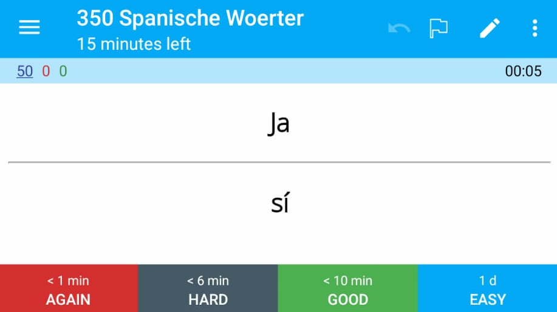

# Anki Deck Creator

This repository contains a simple Python script that given an input JSON generates an [Anki](https://en.wikipedia.org/wiki/Anki_(software)) deck.

Below is how the generated cards look like on [AnkiDroid](https://play.google.com/store/apps/details?id=com.ichi2.anki&hl=en_IE&gl=US)



## Usage

### Requirements

[genanki](https://pypi.org/project/genanki/) needs to be installed.

```bash
$ pip3 install genanki
```

### Input Format

As an input, a file in the following format is expected.

```json
{
    "from": "spanish",
    "to": "german",
    "name": "2 Worte in Spanisch",
    "words": [
        { "spanish": "Yo", "german": "ich" },
        { "spanish": "ser", "german": "sein" }
    ]
}
```

The language names in the `from` and `to` are the keys for the words you pass as a list inside `words`.
What is specified in `name` is the Anki Deck name, i.e. what is shown in Anki.

### Run

It is expected to pass exactly one argument, which is the input JSON.

```bash
$ python3 ankideckcreator.py my_list.json
```

The output is a single `.apkg` file.
It is placed along the input file with the suffix `.apkg`.
Above example would generate a file `my_list.json.apkg`.